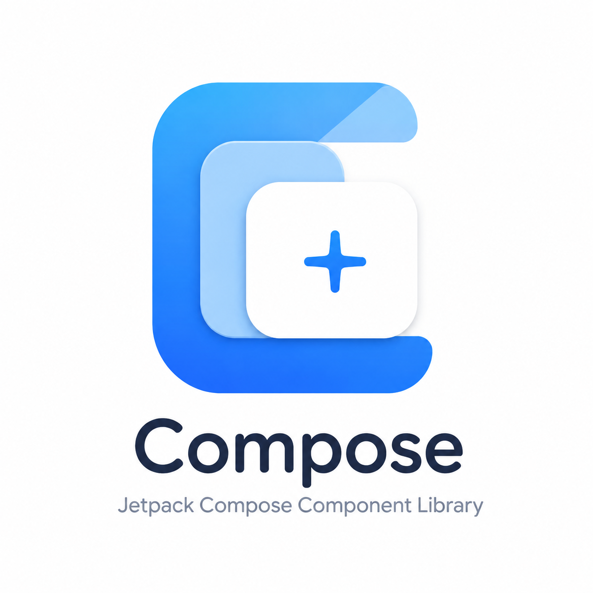

<div align="center">
  

  <h1>XinComponent</h1>
  <p>面向生产环境的 Jetpack Compose Android 设计系统与组件库</p>

  <p><a href="README_EN.md">English</a></p>

  [](https://kotlinlang.org/)
  [](https://developer.android.com/compose)
  [](https://m3.material.io/)
  [](LICENSE)
</div>

XinComponent 为 Compose 项目提供统一的设计令牌、主题和基础交互组件。当前版本优先保证 API 清晰、主题一致、状态完整、可扩展和可发布；不会把尚未实现的模块描述成可用功能。

## 当前状态

项目处于 `0.x` 快速演进阶段，适合试点接入和共同建设。公开 API 在 `1.0.0` 前仍可能调整。

| 模块 | 状态 | 内容 |
| --- | --- | --- |
| `ui` | 可用 | Material 3 主题、语义颜色、文字颜色、间距令牌、按钮、对话框 |
| `network` | 预留 | 尚无公开网络 API，请勿在生产项目中依赖 |
| `utils` | 预留 | 尚无公开工具 API，请勿在生产项目中依赖 |

## 特性

- 基于 Material 3，支持明暗主题、Android 12+ 动态色和自定义品牌主色。
- 通过 `XinTheme` 提供语义颜色、文字颜色和统一的 4dp 间距体系。
- 按钮覆盖填充、描边、渐变、语义类型、尺寸、禁用和加载状态。
- 对话框支持确认/取消、异步确认、关闭策略、最大宽度和插槽式内容扩展。
- AAR 发布包含源码包和 Maven POM 元数据，公共 Compose 类型通过 `api` 正确暴露。
- 最低支持 Android 7.0（API 24），使用 Kotlin 2.3.20、Compose 1.11.4、Material 3 1.4.0。

## 安装

### Jitpack

在 `settings.gradle.kts` 中添加仓库。

```kotlin
dependencyResolutionManagement {
    repositories {
        google()
        mavenCentral()
        maven {
            url = uri("https://jitpack.io")
        }
    }
}
```

在 `build.gradle.kts`  中添加使用
```kotlin
dependencies {
    implementation("com.github.Akiha678:XinComponent:v0.1.1")
}
```


## 快速开始

在应用根节点包裹 `AppTheme`：

```kotlin
@Composable
fun MyApp() {
    AppTheme(
        dynamicColor = false,
    ) {
        // App content
    }
}
```

如需品牌色或完全跟随系统的明暗模式：

```kotlin
AppTheme(
    darkTheme = isSystemInDarkTheme(),
    themeColor = Color(0xFF006C4C),
    dynamicColor = Build.VERSION.SDK_INT >= Build.VERSION_CODES.S,
) {
    AppContent()
}
```

## 设计令牌

组件和业务页面都应优先使用令牌，避免散落的颜色和间距常量：

```kotlin
@Composable
fun StatusMessage() {
    Text(
        text = "保存成功",
        color = XinTheme.colors.success,
        modifier = Modifier.padding(XinTheme.spacing.large),
    )
}
```

可用入口：

- `MaterialTheme.colorScheme`：Material 3 基础颜色。
- `XinTheme.colors`：`success`、`warning`、`danger`、`info`、`onStatus`。
- `XinTheme.textColors`：`primary`、`secondary`、`tertiary`、`quaternary`、`white`、`link`。
- `XinTheme.spacing`：从 `none` 到 `huge` 的统一间距刻度。

## 组件

### Button

```kotlin
AppButton(
    text = "提交",
    type = ButtonType.SUCCESS,
    style = ButtonStyle.GRADIENT,
    size = ButtonSize.MEDIUM,
    loading = isSubmitting,
    enabled = formIsValid,
    onClick = ::submit,
)
```

按钮 API：

- `AppButton`：默认占满可用宽度的主操作按钮。
- `AppButtonFixed`：由内容决定宽度的紧凑按钮。
- `AppButtonBordered`：兼容 API，等价于可定制颜色的描边按钮。
- `AppButtonCustomSize`：需要明确宽高时使用。
- `ButtonStyle`：`FILLED`、`OUTLINED`、`GRADIENT`。
- `ButtonType`：`DEFAULT`、`SUCCESS`、`WARNING`、`DANGER`、`PURPLE`、`LINK`。

`loading = true` 时组件会禁用点击并保持原标签布局，避免宽度跳动和重复提交。

### Dialog

```kotlin
if (showDeleteDialog) {
    AppDialog(
        title = "确认删除",
        content = "删除后数据无法恢复，确定继续？",
        okText = "删除",
        okColor = ColorDanger,
        confirmLoading = isDeleting,
        onOk = ::delete,
        onCancel = { showDeleteDialog = false },
        onDismiss = { showDeleteDialog = false },
    )
}
```

对话框不会在回调后自动关闭。可见性由调用方持有，因此异步操作期间可以通过 `confirmLoading` 保持对话框并阻止重复操作。复杂内容可使用同名的插槽式 `AppDialog` API。

## 项目结构

```text
XinComponent/
├── ui/       # Compose 主题、令牌和组件
├── network/  # 预留网络模块
├── utils/    # 预留工具模块
├── docs/     # 文档资源
└── gradle/   # 版本目录与 Wrapper 配置
```

## 构建与质量检查

需要 JDK 21 和 Android SDK（compile SDK 37）。项目固定使用 Gradle Wrapper，请勿依赖本机 Gradle 版本。

```bash
# 单元测试
./gradlew test

# Android Lint
./gradlew lint

# 生成所有 AAR
./gradlew assembleRelease

# 发布到本机 Maven 仓库
./gradlew publishToMavenLocal

# 发布到 GitHub Packages
GITHUB_USERNAME=your-name GITHUB_TOKEN=your-token ./gradlew publish
```

提交代码前至少运行 `./gradlew test lint assembleRelease`。

## 版本与兼容性

项目遵循语义化版本：

- 修订版本：缺陷修复，不改变预期 API 行为。
- 次版本：新增向后兼容能力；`0.x` 阶段也可能包含明确记录的 API 调整。
- 主版本：稳定版中的破坏性变更。

建议应用锁定明确版本，不使用动态版本号。主题令牌应通过 `XinTheme`/`MaterialTheme` 获取，不直接依赖库内颜色实现细节。

## 路线图

- 建立示例应用和完整组件目录，补充截图与交互演示。
- 为 Button、Dialog 和 Theme 增加 Compose UI/截图测试及无障碍检查。
- 增加 Input、Card、Snackbar、Empty、Loading、List 等高频组件。
- 建立 API 二进制兼容检查、Dokka 文档、Detekt/Ktlint 和 CI 发布流水线。
- 在真实需求确定前保持 `network`、`utils` 为空，避免形成不必要的平台耦合。

## 贡献

欢迎 Issue 和 Pull Request。新增组件应包含：清晰的公开 API、明暗主题行为、加载/禁用/错误状态、无障碍语义、示例、测试和变更说明。请勿在组件内部硬编码业务文案。

## License

XinComponent 使用 [Apache License 2.0](LICENSE) 开源。
